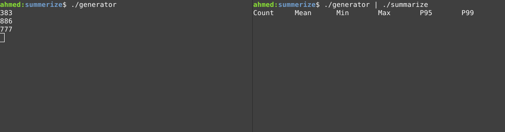

# What is summarize?
Summarize gives you Summary about stream of numbers and it updates the summary every specified interval.


# Installation
```bash
curl -sSL -o summarize https://github.com/ahmedakef/summarize/releases/download/v1.0.0-alpha/summarize
chmod +x summarize
```
# Usage
to summarize numbers from standard input:
```bash
summarize
```

to summarize numbers from file:
```bash
summarize -f file_name
```

other options:
```
  -h [ --help ]               Produce help message
  -f [ --file ] arg           Read input from a file
  -d [ --delay ] arg (=1)     Delay time between re-calculating
  -p [ --precision ] arg (=2) Control the precision parameter
```

# Common Usage
Usally you won't get a stream of numbers in your logs, you will need to precess the logs first to extract the numers you want only

Assume that `./generate` produce this logs:
```
the request took 383 seconds to complete
the request took 886 seconds to complete
the request took 777 seconds to complete
```
you can use `awk` first then pass the resut to `summarize`
```bash
./generator | awk -W interactive '{print $4}' | ./summarize
```

# building from source
```bash
make
```
## Required libraries
* Boost Program Options

On Debian-based distributions, the above can be installed with

```
sudo apt install libboost-program-options-dev
```
On Mac OS:
```
sudo port install boost
```